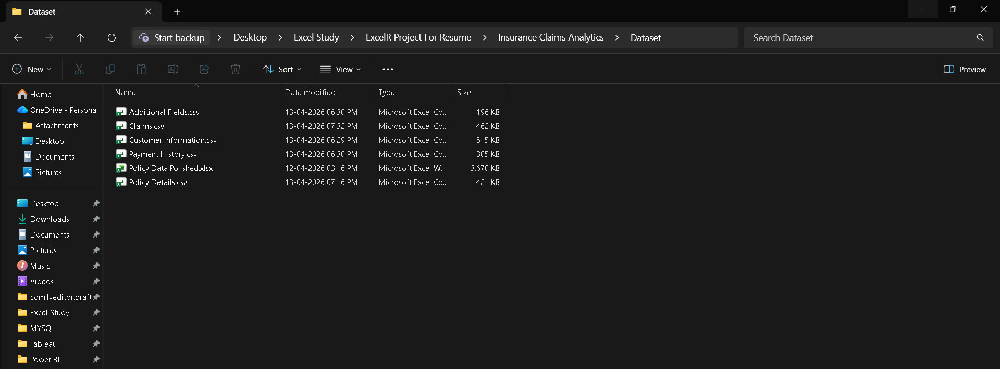
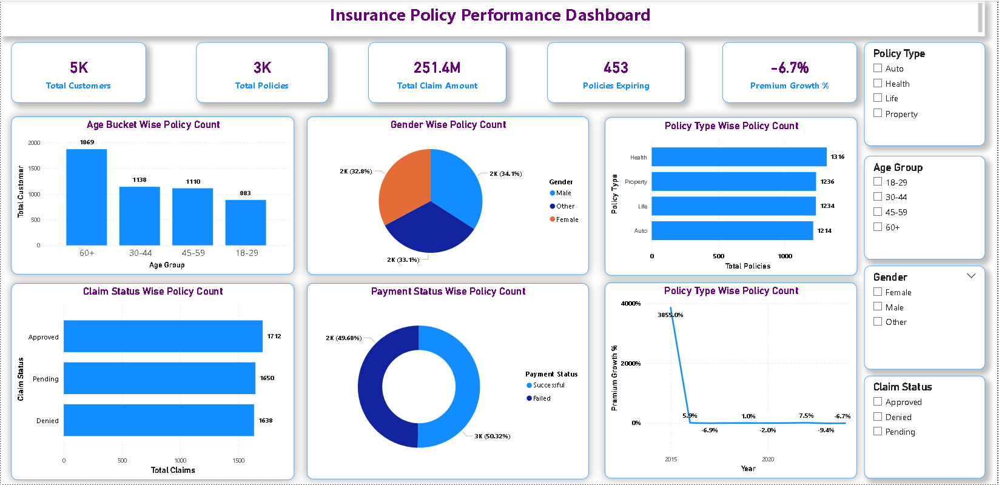
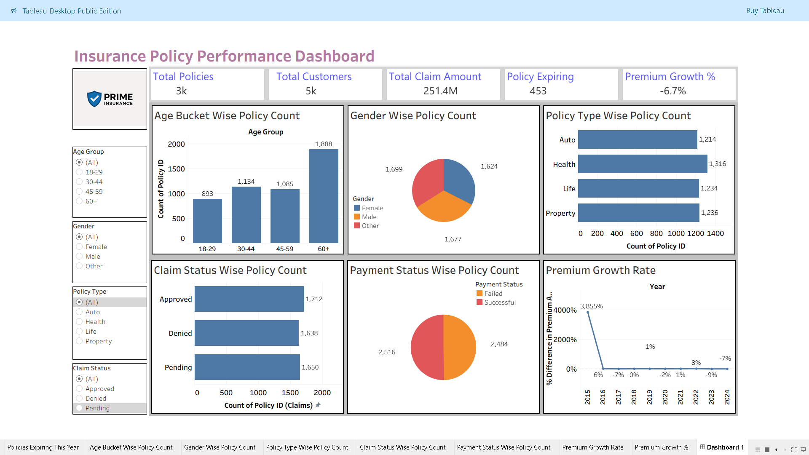

# 🛡️ Insurance Claims & Policy Analytics

An end-to-end Insurance Data Analytics project built using **MySQL, Power BI, Tableau, and Excel** to analyze customer, policy, claim, and payment data. The project focuses on identifying business trends, monitoring KPIs, and providing actionable insights through interactive dashboards.

---

# 📌 Project Overview

The objective of this project is to analyze insurance policy performance and customer claim behavior using SQL and Business Intelligence tools. The dashboard helps insurers monitor policy growth, customer demographics, payment performance, claim status, and premium trends for better decision-making.

---

# 📂 Dataset

The project uses multiple datasets consisting of over **300,000+ insurance records**.

### Dataset Files

- Additional Fields.csv
- Customer Information.csv
- Policy Details.csv
- Claims.csv
- Payment History.csv

### Dataset Preview



---

# 🛠 Tools Used

- Microsoft Excel
- MySQL
- Power BI
- Tableau

---

# ⚙️ Project Workflow

```
Raw Dataset
      │
      ▼
Excel Data Cleaning
      │
      ▼
MySQL Database Creation
      │
      ▼
SQL KPI Queries
      │
      ▼
Power BI Dashboard
      │
      ▼
Tableau Dashboard
      │
      ▼
Business Insights
```

---

# 📊 Key Performance Indicators (KPIs)

- Total Customers
- Total Policies
- Total Claim Amount
- Policies Expiring
- Premium Growth %
- Age Bucket Analysis
- Gender Distribution
- Policy Type Analysis
- Claim Status Analysis
- Payment Status Analysis

---

# 💻 SQL Implementation

The database was created in MySQL and SQL queries were written to calculate business KPIs and generate insights.

### SQL Database


### KPI Queries


---

# 📈 Power BI Dashboard

Interactive dashboard developed using Power BI featuring dynamic filters, KPI cards, and visual analytics.



---

# 📉 Tableau Dashboard

A Tableau dashboard was created to validate insights and provide an additional interactive reporting experience.



---

# 📌 Business Insights

- Analyzed **300K+ insurance records** across customers, policies, claims, and payments.
- Processed information for **5,000 customers** and **3,000 policies**.
- Total claim amount exceeded **251.4 Million**.
- Health Insurance recorded the highest number of active policies.
- Customers aged **60+** purchased the highest number of policies.
- Identified **453 policies** approaching expiration.
- Claim approvals exceeded denied claims.
- Premium growth trends revealed yearly fluctuations in business performance.

---

# 📁 Repository Structure

```
Insurance-Claims-Analytics
│
├── Dataset
│   ├── Additional Fields.csv
│   ├── Claims.csv
│   ├── Customer Information.csv
│   ├── Payment History.csv
│   └── Policy Details.csv
│
├── SQL
│   └── Insurance Query.sql
│
├── Presentation
│   └── Insurance Presentation.pptx
│
├── Images
│   ├── dataset.png
│   ├── Sql Database Query.png
│   ├── Query.png
│   ├── powerbi_dashboard.png
│   └── tableau_dashboard.png
│
└── README.md
```

---

# 🚀 How to Run

1. Download or clone the repository.
2. Import the CSV files into MySQL.
3. Execute the SQL queries provided in the SQL folder.
4. Open the Power BI dashboard (.pbix).
5. Open the Tableau workbook (.twb/.twbx).
6. Explore KPIs using interactive filters and slicers.

---

# 📬 Connect With Me

**Ritesh Gaikwad**

- LinkedIn: https://linkedin.com/in/riteshgaikwad2196
- GitHub: https://github.com/RiteshGaikwadGit

---